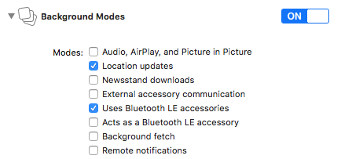

# Oneup connect for iOS

### Table of Contents
- [Installation](#installation)
	- [1. Add Library with Cocoapods](#1.-Add-Library-with-Cocoapods)
	- [2. Project Settings](#2.-Project-Settings)
		- [Enable Bluetooth Background Mode](#Enable-Bluetooth)
		- [Define Location User Permission Description](#Define-Location-User-Permission-Description)
	- [3. Important: Manage User Permission Authorizations in your Application](#3.-Important:-Manage-User-Permission-Authorizations-in-your-Application)
	- [4. Source Code to start the monitoring](#4.-Source-Code-to-start-the-monitoring)
- [Sample App](#sample-app)

## Installation

### 1. Add Library with Cocoapods

Get [Cocoapods](https://cocoapods.org/) and add the pod to your podfile.

```
pod 'oneupconnectSDK'
```

run

```
pod install
```

### 2. Project Settings

#### Enable Bluetooth Background Mode

To allow the app to run in the background when in range of beacons, we need to enable the Bluetooth Background Mode in our Xcode project.

1. Select the project in the left sidebar, and on the right, go to “Capabilities”.
2. Flip the Background Modes to “ON”.
3. Expand the Background Modes section and check the “Uses Bluetooth LE accessories” option.



#### Define Location User Permission Description

In the project navigator, find the Info.plist file, right click on it, and select “Open As”, “Source Code”. Then, inside the top-level <dict> section, add:

	<key>NSLocationWhenInUseUsageDescription</key>
	<string>We'll show you cool things near you in the app.</string>
	
	<!-- iOS 10 or earlier -->
	<key>NSLocationAlwaysUsageDescription</key>
	<string>We'll show you cool things near you in the app, and alert you via
	notifications if you don't have the app open.</string>
	
	<!-- iOS 11 -->
	<key>NSLocationAlwaysAndWhenInUseUsageDescription</key>
	<string>We'll show you cool things near you in the app. With the "always" option,
	we can also alert you via notifications if you don't have the app open.</string>

### 3. Important: Manage User Permission Authorizations in your Application

To be able to work correctly, the user must have: 

 - the bluethooth turned ON
 - allowed the Location permision with "Always Allow"

You have to validate them and include screen/dialog to inform and suggest the users to enable them as often as possible.

### 4. Source Code to start the monitoring

Include this code to start the monitoring:


```
#import <oneupconnectSDK/OUManager.h>

...

OUManager *ouManager = [OUManager new];
[OUManager setAppToken:@"YOUR_API_KEY"];
[ouManager startMonitoring];

```


## Sample App

To run the example project, clone the repo, and run `pod install` from the Example directory.
